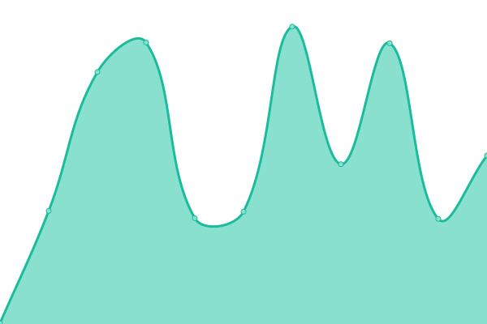
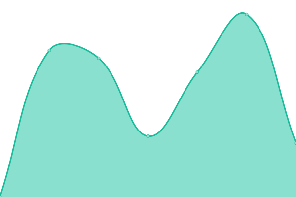

# [📈 Live Status](https://status.triviaties.com): <!--live status--> **🟧 Partial outage**

This repository contains the open-source uptime monitor and status page for [The API Guys](https://theapiguys.com), powered by [Upptime](https://github.com/upptime/upptime).

With [Upptime](https://upptime.js.org), you can get your own unlimited and free uptime monitor and status page, powered entirely by a GitHub repository. We use [Issues](https://github.com/TheAPIGuysDev/triviaties-status/issues) as incident reports, [Actions](https://github.com/TheAPIGuysDev/triviaties-status/actions) as uptime monitors, and [Pages](https://status.triviaties.com) for the status page.

<!--start: status pages-->
<!-- This summary is generated by Upptime (https://github.com/upptime/upptime) -->
<!-- Do not edit this manually, your changes will be overwritten -->
<!-- prettier-ignore -->
| URL | Status | History | Response Time | Uptime |
| --- | ------ | ------- | ------------- | ------ |
|  [Triviaties Web](https://triviaties.com/) | 🟩 Up | [triviaties-web.yml](https://github.com/TheAPIGuysDev/triviaties-status/commits/HEAD/history/triviaties-web.yml) | 

 338ms
     
 | 

<a href="https://status.triviaties.com/history/triviaties-web">99.03%</a>
    

|  [Triviaties App](https://app.triviaties.com/) | 🟥 Down | [triviaties-app.yml](https://github.com/TheAPIGuysDev/triviaties-status/commits/HEAD/history/triviaties-app.yml) | 

 245ms
     
 | 

<a href="https://status.triviaties.com/history/triviaties-app">96.01%</a>
    

|  [Triviaties API (ping)](https://api.triviaties.com/ping/) | 🟩 Up | [triviaties-api-ping.yml](https://github.com/TheAPIGuysDev/triviaties-status/commits/HEAD/history/triviaties-api-ping.yml) | 

 344ms
     
 | 

<a href="https://status.triviaties.com/history/triviaties-api-ping">99.06%</a>
    

|  [Triviaties API (readiness)](https://api.triviaties.com/healthz/) | 🟩 Up | [triviaties-api-readiness.yml](https://github.com/TheAPIGuysDev/triviaties-status/commits/HEAD/history/triviaties-api-readiness.yml) | 

 117ms
     
 | 

<a href="https://status.triviaties.com/history/triviaties-api-readiness">99.09%</a>
    

<!--end: status pages-->

[**Visit our status website →**](https://status.triviaties.com)

## 📄 License

- Powered by: [Upptime](https://github.com/upptime/upptime)
- Code: [MIT](./LICENSE) © [Anand Chowdhary](https://anandchowdhary.com), supported by [Pabio](https://pabio.com)
- Data in the `./history` directory: [Open Database License](https://opendatacommons.org/licenses/odbl/1-0/)
